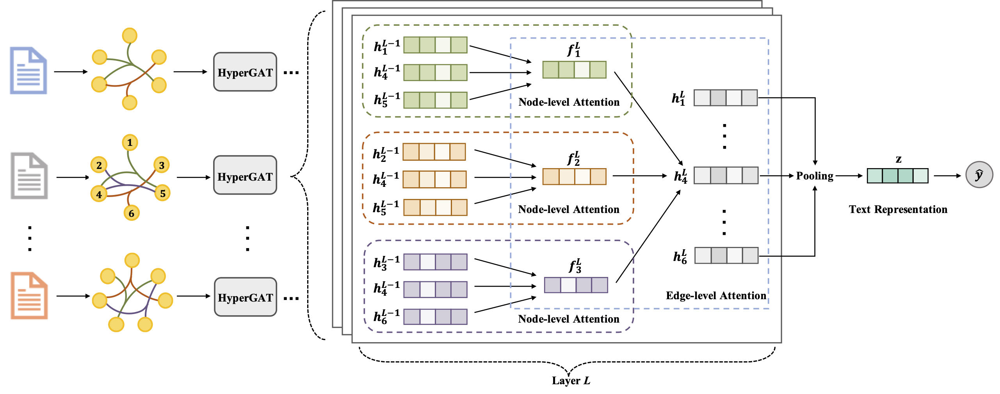

Hypergraph Attention Networks for Inductive Text Classification(EMNLP2020)
============

## HyperGAT

This is the source code of paper ["Be More with Less: Hypergraph Attention Networks for Inductive Text Classification"](https://www.aclweb.org/anthology/2020.emnlp-main.399.pdf).



## Requirements
python==3.6.6

nltk==3.4.5

scikit-learn==0.21.3

numpy==1.19.4

torch==1.4.0

## Usage
Example of LDA-related preprocessing: ```python generate_lda.py --topics 52 --dataset R52```

Example of running HyperGAT: ```python run.py --dataset R52 --use_LDA --batchSize 8 --lr 0.001 --dropout 0.3 --l2 1e-6 --epoch 10```

## Cite

Please cite our paper if you use this code in your own work:

```
@inproceedings{ding2020more,
  title={Be More with Less: Hypergraph Attention Networks for Inductive Text Classification},
  author={Ding, Kaize and Wang, Jianling and Li, Jundong and Li, Dingcheng and Liu, Huan},
  booktitle={Proceedings of the 2020 Conference on Empirical Methods in Natural Language Processing (EMNLP)},
  pages={4927--4936},
  year={2020}
}
```

